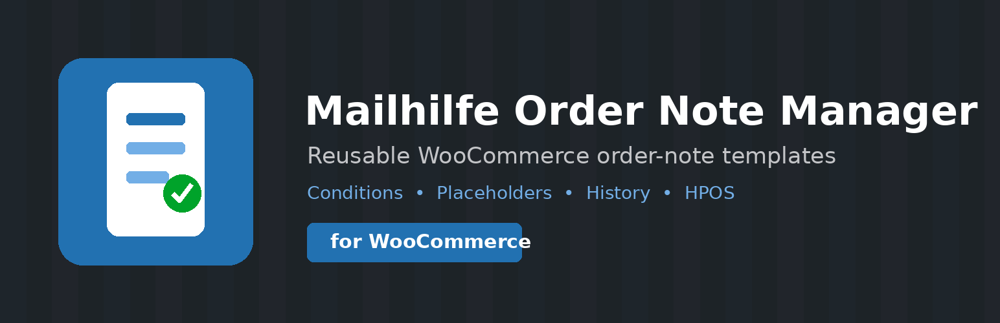
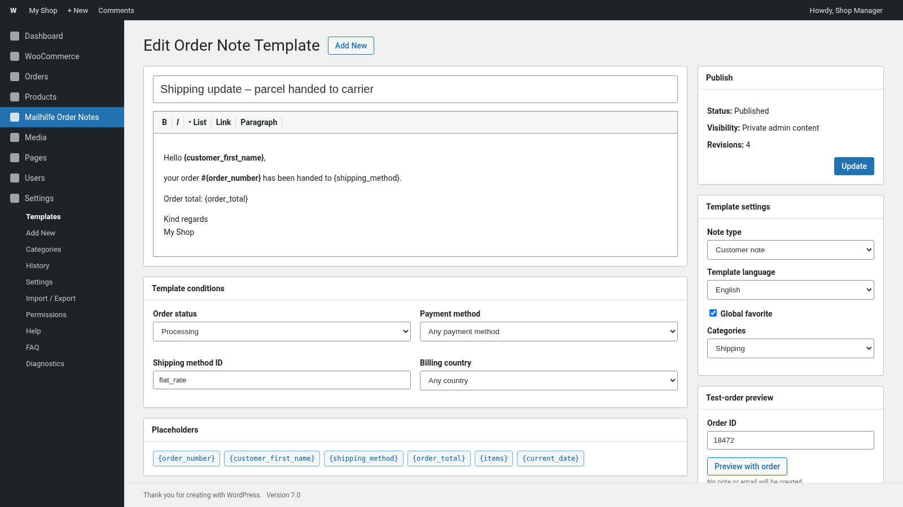
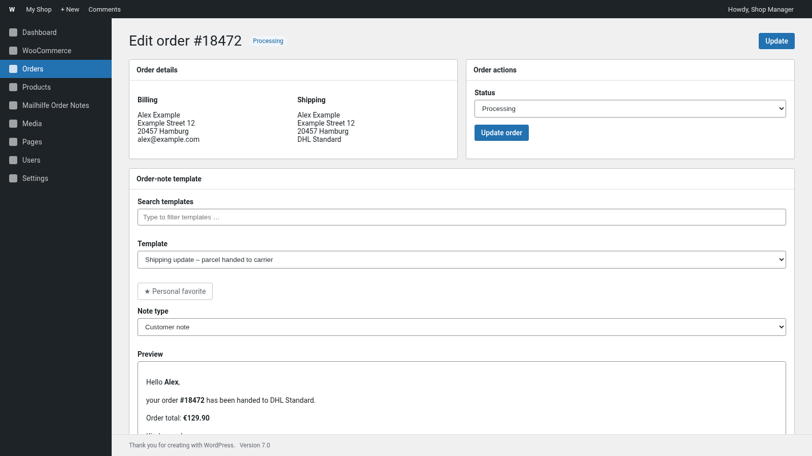
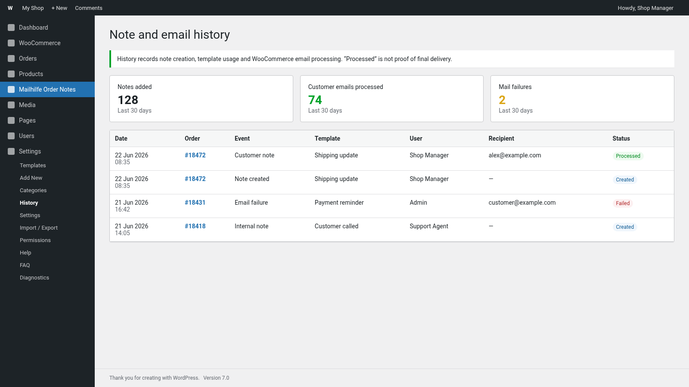
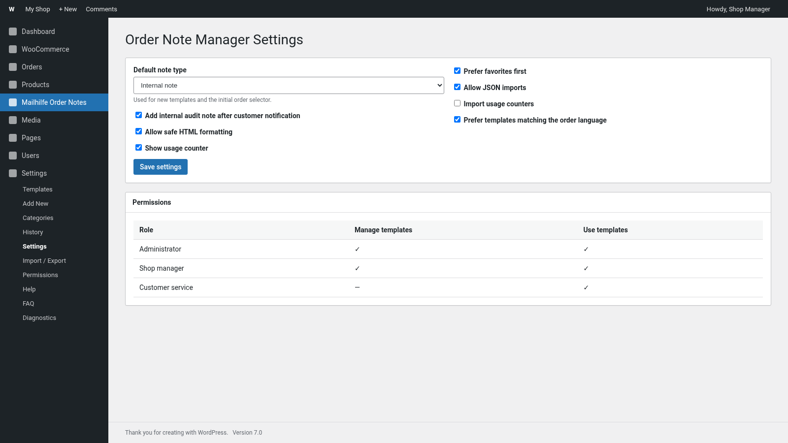
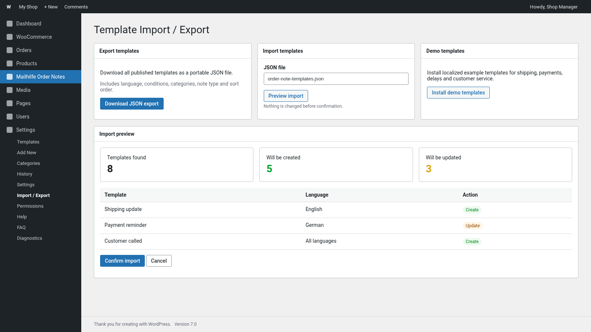
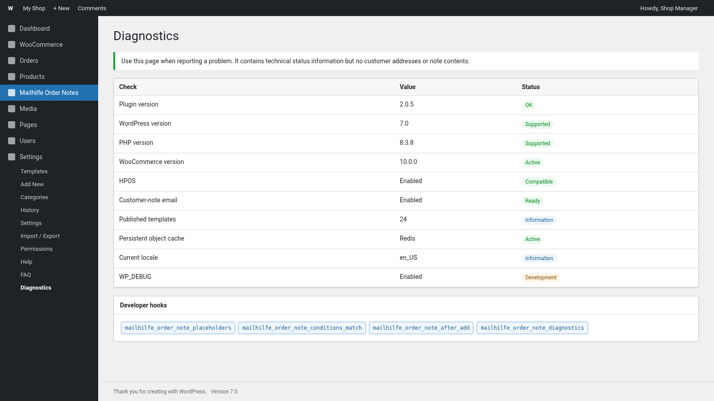

<p align="center">
  
</p>

# Mailhilfe Order Note Manager for WooCommerce

Reusable, multilingual WooCommerce order-note templates with conditions, placeholders, editable previews, history, permissions and HPOS compatibility.


## Overview

Mailhilfe Order Note Manager helps WooCommerce teams create consistent internal notes and customer notes from reusable templates. Placeholders are replaced with live order data, the generated note can be edited before saving, and customer-note processing can be tracked centrally.

### Main features

- Create, edit, duplicate, categorize, favorite and sort templates.
- Add internal notes or customer notes directly from the WooCommerce order screen.
- Editable preview with order, customer, billing, shipping, totals, items and custom-meta placeholders.
- Template conditions for order status, payment method, shipping method, billing country and order total.
- Template language selection with multilingual order matching.
- Personal favorites and recently used templates per WordPress user.
- Central note, usage and email-processing history with order links.
- Test-order preview in the template editor without creating a note or sending an email.
- JSON import/export with a confirmation preview.
- Role and capability management.
- Diagnostics page for WordPress, WooCommerce, HPOS, email, locale and cache status.
- HPOS-compatible WooCommerce APIs and server-side permission checks.
- Bundled help, FAQ and translations for 20 widely used languages plus formal German.
- Developer hooks and filters for custom integrations.

## Screenshots

### Template editor



### WooCommerce order integration



### Central history



### Settings and permissions



### JSON import/export



### Diagnostics



The screenshots contain example data and are intended as documentation previews of the current admin layouts.

## Requirements

- WordPress 6.4 or later
- PHP 7.4 or later
- WooCommerce 8.2 or later

## Installation

1. Download an installable release ZIP.
2. In WordPress, open **Plugins → Add New Plugin → Upload Plugin**.
3. Upload the ZIP and activate it.
4. Open **Mailhilfe Order Notes** in the WordPress admin menu.
5. Create a template or install the localized demo templates.
6. Open a WooCommerce order and use the **Order-note template** box.

For development, clone this repository into `wp-content/plugins/mailhilfe-order-note-manager`.

## Building an installable release

Linux/macOS/Git Bash:

```bash
bash scripts/build-release.sh
```

Windows PowerShell:

```powershell
./scripts/build-release.ps1
```

The installable ZIP is created in `build/` and excludes repository-only documentation, workflows and development files.

## Developer hooks

The plugin includes filters and actions for placeholders, conditions, note content, history and diagnostics. See [Developer hooks and filters](docs/DEVELOPER-HOOKS.md).

## Documentation

- [German README](README.de.md)
- [Developer hooks and filters](docs/DEVELOPER-HOOKS.md)
- [Translations](docs/TRANSLATIONS.md)
- [Release checklist](docs/RELEASE-CHECKLIST.md)
- [WordPress.org asset package](wordpress-org-assets/README.md)
- [GitHub publishing guide](GITHUB-PUBLISHING.md)
- [Security policy](SECURITY.md)
- [Contribution guide](CONTRIBUTING.md)

The WordPress.org-compatible plugin description and complete historical changelog remain in [`readme.txt`](readme.txt).

## Security

Please do not disclose security vulnerabilities in public issues. Follow the process in [SECURITY.md](SECURITY.md).

## License

GPL-2.0-or-later. See [LICENSE](LICENSE).
